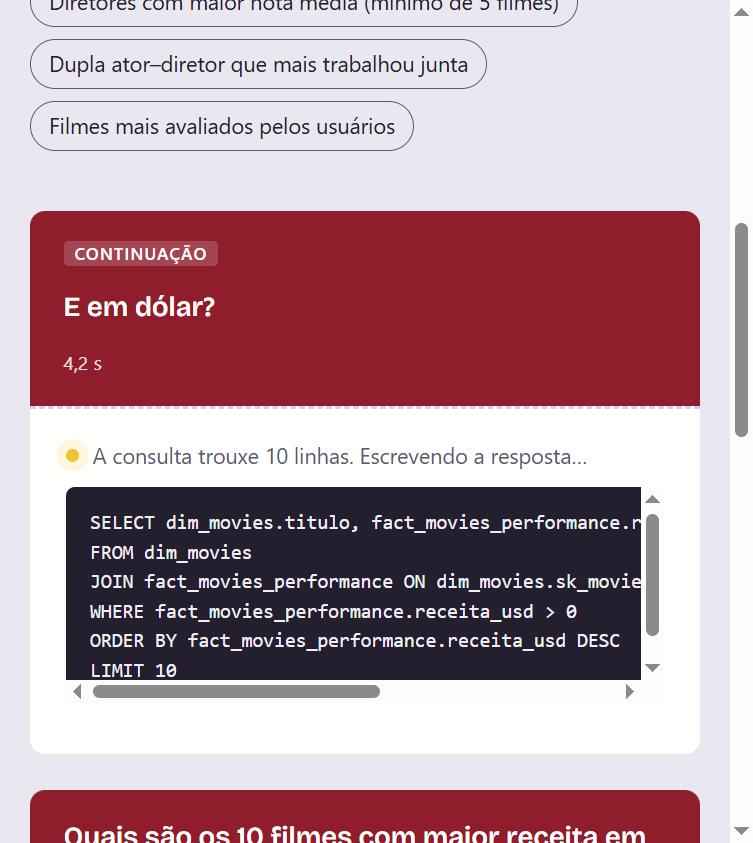
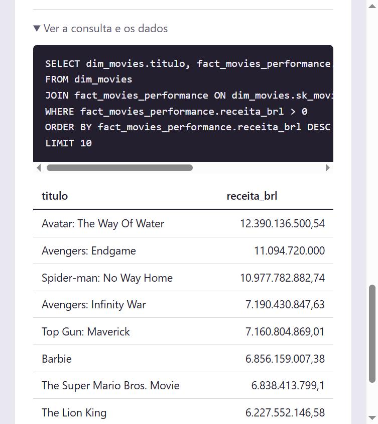

# CineData Agent

Agente Text-to-SQL que responde perguntas em linguagem natural sobre o catálogo de filmes da
CineData Analytics, consultando a camada Gold (`cinerocket.db`, SQLite) em modo somente leitura.

Atividade de GenAI do Rocket Lab 2026 (Visagio).

## Interface

A resposta chega em tempo real: primeiro a etapa e o SQL gerado, depois o texto enquanto o
modelo escreve.



| Resposta | Gráfico gerado do resultado |
|---|---|
|  |  |

| Consulta e dados brutos, para conferência | Continuação da conversa ("E em dólar?") |
|---|---|
|  |  |

## Stack

| Item | Escolha |
|---|---|
| Linguagem | Python 3.11+ |
| Framework de agentes | [PydanticAI](https://ai.pydantic.dev) |
| Modelos | Gratuitos (`:free`) via OpenRouter, com fallback automático |
| Entregável | Módulo de backend FastAPI |
| Banco | SQLite (`cinerocket.db`) |

## Como executar

1. Clone o repositório e entre na pasta:

   ```bash
   git clone <url-do-repositorio>
   cd cinedata-agent
   ```

2. Crie o ambiente virtual e instale as dependências:

   ```bash
   python -m venv .venv
   # Windows: .venv\Scripts\activate
   source .venv/bin/activate
   pip install -r requirements.txt
   ```

3. Baixe o `cinerocket.db` da pasta compartilhada da atividade e coloque-o na raiz do projeto
   (ao lado deste README).

4. Configure a chave do OpenRouter:

   ```bash
   # Windows: copy .env.example .env
   cp .env.example .env
   ```

   Edite o `.env` e preencha `OPENROUTER_API_KEY` com a sua chave (`sk-or-v1-...`),
   criada em <https://openrouter.ai/keys>.

5. Suba a API:

   ```bash
   uvicorn app.main:app --reload
   ```

6. Abra <http://localhost:8000> para usar a interface web. A documentação interativa da API
   fica em <http://localhost:8000/docs>. Também dá para perguntar pelo terminal:

   ```bash
   curl -X POST http://localhost:8000/perguntar \
     -H "Content-Type: application/json" \
     -d '{"pergunta": "Quais são os 10 filmes com maior receita em R$?"}'
   ```

## Rotas

| Rota | Descrição |
|---|---|
| `GET /` | Interface web: resposta em tempo real, SQL executado, gráfico de barras e tabela de dados |
| `POST /perguntar` | Recebe `{"pergunta": "...", "conversa_id": "..."}` (o id é opcional) e devolve a resposta, o SQL executado, as linhas retornadas, o modelo usado, quantas chamadas ao LLM foram feitas e o `conversa_id` |
| `POST /perguntar/stream` | Mesma entrada, mas responde em etapas via Server-Sent Events (ver abaixo) |
| `GET /schema` | Schema que o agente enxerga (gerado a partir do banco) |
| `GET /cota` | Uso da cota diária de modelos gratuitos no OpenRouter |
| `GET /health` | Verificação simples |

Exemplo de resposta de `/perguntar`:

```json
{
  "resposta": "1. ...",
  "consultas": [
    {"sql": "SELECT ...", "colunas": ["titulo", "receita_brl"], "linhas": [["...", 0.0]], "truncado": false, "erro": null}
  ],
  "modelo": "nvidia/nemotron-3.5-lightning:free",
  "requisicoes_llm": 2,
  "cache": false,
  "conversa_id": "2838405552a247e0a2c9a7ec331c8d92"
}
```

### Histórico de conversa

Para fazer uma pergunta de continuação ("e em dólar?", "e só os de 2023?"), envie o
`conversa_id` devolvido pela resposta anterior. Sem ele, cada pergunta começa uma conversa nova.

```bash
curl -X POST http://localhost:8000/perguntar \
  -H "Content-Type: application/json" \
  -d '{"pergunta": "E em dólar?", "conversa_id": "2838405552a247e0a2c9a7ec331c8d92"}'
```

- O histórico fica no servidor, em memória, e guarda as **últimas 5 perguntas** de cada conversa.
- Para economizar tokens, cada turno guarda só a pergunta, a resposta final e o SQL que deu
  certo. Os dados brutos das consultas não são reenviados ao modelo.
- O cache vale só para a primeira pergunta de uma conversa: uma continuação depende do
  contexto e sempre consulta o modelo.
- Na interface, o botão **Nova conversa** começa do zero.

### Streaming (`/perguntar/stream`)

Cada evento é uma linha `data: {json}` com um campo `tipo`:

| `tipo` | Quando | Conteúdo |
|---|---|---|
| `consulta` | o modelo decidiu rodar um SQL | `sql` |
| `resultado` | o SQL terminou | `colunas`, `linhas`, `truncado`, `erro` |
| `texto` | o modelo escreveu mais um trecho da resposta | `trecho` |
| `fim` | a resposta está completa | o mesmo corpo de `POST /perguntar` |
| `erro` | nenhum modelo respondeu ou o limite de chamadas estourou | `status`, `detail` |

```bash
curl -N -X POST http://localhost:8000/perguntar/stream \
  -H "Content-Type: application/json" \
  -d '{"pergunta": "Os 5 filmes mais populares"}'
```

A interface web usa essa rota: mostra a etapa atual, o SQL assim que ele é gerado, o texto
aparecendo enquanto o modelo escreve e, no fim, um gráfico de barras quando o resultado é
"rótulo + número" (ex.: top 10 por receita).

## Como funciona

```
pergunta -> FastAPI -> agente (PydanticAI) -> tool executar_sql -> SQLite (read-only)
                          ^                          |
                          +------ resultado ---------+ -> resposta em português
```

- **System prompt com schema dinâmico** (`app/prompts.py`): na inicialização, o schema é lido do
  próprio banco, incluindo os valores reais de colunas categóricas como `tipo_pessoa`. O agente
  não gasta chamadas explorando tabelas. O prompt também traz o glossário de negócio
  (receita = faturamento = bilheteria, margem de lucro, "receita informada" etc.).
- **Guardrails de SQL** (`app/database.py`): conexão `mode=ro`, authorizer do SQLite que só
  permite `SELECT`, uma instrução por chamada, tabelas internas bloqueadas, limite de 50 linhas
  e timeout de 30 s por consulta.
- **Desempenho**: o banco tem ~580 MB e as chaves são hashes em texto. As conexões usam
  `mmap` (junções grandes caíram de ~25 s para ~2 s) e o prompt orienta a ordem de junção nas
  consultas pessoa × pessoa, como a da dupla ator–diretor.
- **Fallback entre modelos** (`app/agent.py`): se um modelo falhar (ex.: `429` por pool lotado),
  o próximo da lista `MODELOS` é tentado. Não há retry no mesmo modelo, porque requisições que
  falham também contam na cota diária.
- **Proteção da cota**: no máximo `MAX_REQUISICOES_POR_PERGUNTA` chamadas ao LLM por pergunta
  (padrão 4; o caso normal usa 2) e cache em memória de perguntas repetidas.
- **Transparência**: a resposta da API inclui o SQL executado e os dados brutos, para conferência.
- **Resposta sem consulta**: alguns modelos gratuitos às vezes escrevem o SQL no texto em vez
  de executá-lo. Um validador de saída detecta isso e devolve a instrução ao modelo
  (`ModelRetry`). Só respostas apoiadas em uma consulta válida entram no cache.

## Testes

```bash
pytest
```

Os testes usam um banco temporário e um modelo falso: **não consomem requisições do OpenRouter**.
Cobrem os guardrails de SQL, a geração do schema e o fluxo completo da API (incluindo o cache
e a ordem dos eventos do streaming).

## Avaliação

`avaliacao/casos.py` tem as 14 perguntas de exemplo do enunciado e mais 2 casos de guardrail
(pergunta fora do escopo e pedido para apagar dados). Cada pergunta tem um SQL de referência,
às vezes mais de um quando a pergunta admite leituras razoáveis (ex.: nota IMDb ou TMDB).
O agente passa quando **os dados que ele consultou** batem com os da referência. A comparação
olha os valores, não o SQL: aceita colunas em outra ordem, arredondamento, percentual e
empates na última posição de um ranking.

```bash
# 1. Valida as referências direto no banco: não chama o modelo.
python -m avaliacao

# 2. Roda os casos pendentes gastando no máximo 10 chamadas (padrão).
python -m avaliacao --executar

# Escolhendo casos e orçamento:
python -m avaliacao --executar --orcamento 6 --ids dupla_ator_diretor,fora_do_escopo
```

Cuidados com a cota:

- Sem `--executar`, nada é enviado ao OpenRouter.
- A execução consulta a cota antes de começar e nunca passa de `--orcamento` nem do que
  resta no dia. Para isso, reserva o pior caso (`MAX_REQUISICOES_POR_PERGUNTA`) antes de cada
  pergunta.
- Os resultados ficam em `avaliacao/resultados.json`, e a próxima execução continua de onde
  parou (`--refazer` força rodar de novo). A avaliação completa custa umas 32 chamadas, então
  dá para dividir em dias.
- `avaliacao/relatorio.md` traz a tabela de acertos, gerada a cada execução.

Montar as referências já revelou três problemas, corrigidos antes de gastar qualquer chamada:
consultas de elenco que passavam do timeout (resolvido com `mmap` e uma dica de ordem de junção),
e `nota_tmdb = 0` usada como "sem nota" em ~36 mil filmes (agora o prompt manda filtrar).

## Estrutura

```
app/
  main.py       # rotas FastAPI (JSON e streaming SSE)
  static/index.html  # interface web (HTML único, sem build)
  agent.py      # agente, tool executar_sql, fallback de modelos e eventos de streaming
  prompts.py    # system prompt
  database.py   # acesso read-only, guardrails e introspecção do schema
  schemas.py    # modelos de entrada/saída da API
  config.py     # configurações (.env)
avaliacao/
  casos.py      # perguntas e SQL de referência
  comparar.py   # comparação tolerante entre resultado do agente e referência
  __main__.py   # `python -m avaliacao`
tests/
```

## Configuração (`.env`)

| Variável | Padrão | Descrição |
|---|---|---|
| `OPENROUTER_API_KEY` | (obrigatória) | Chave do OpenRouter |
| `MODELOS` | `nvidia/nemotron-3.5-lightning:free,z-ai/glm-5.2:free,openrouter/free` | Modelos em ordem de preferência; precisam suportar tool calling |
| `CAMINHO_BANCO` | `cinerocket.db` | Caminho do banco SQLite |
| `MAX_REQUISICOES_POR_PERGUNTA` | `4` | Teto de chamadas ao LLM por pergunta |

## Limitações

- O cache é em memória e se perde ao reiniciar o servidor.
- O histórico de conversa também é em memória: some ao reiniciar o servidor.
- A conta gratuita do OpenRouter permite 50 requisições por dia (reset às 21h de Brasília).
